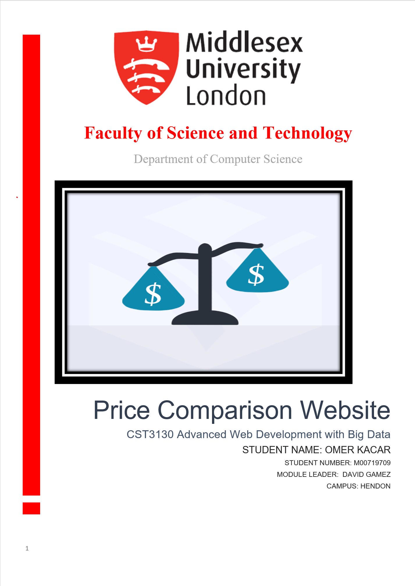
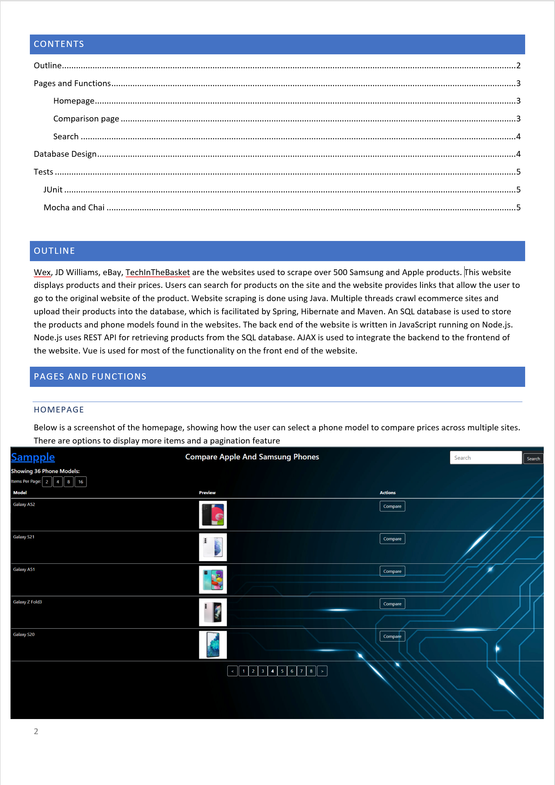
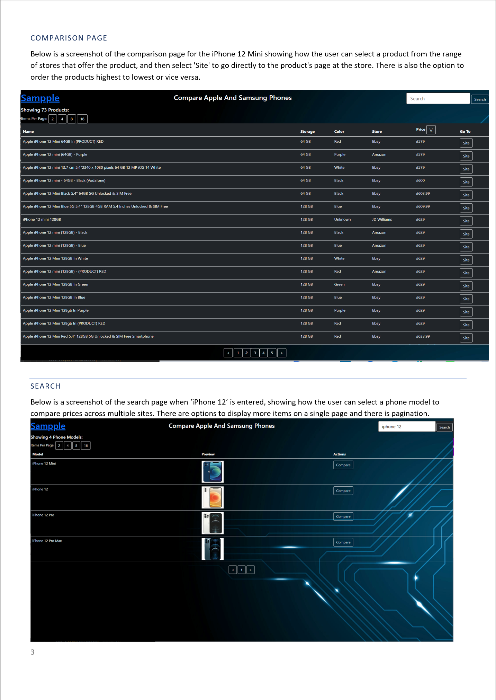
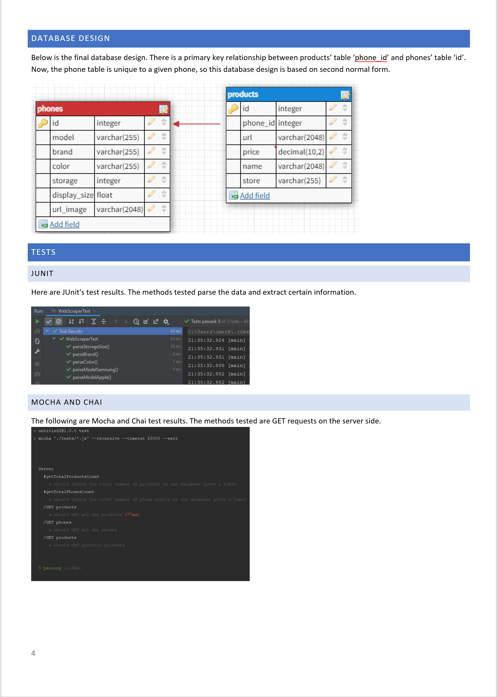

# Price-Comparison-Website

Comparing phone deals across different websites using Spring, Hibernate, Maven, and Node.js.
- Developed a multi-threaded web scraper scraped 600 products from 5 stores in less than a minute using Spring, Hibernate, and Selenium.
- Implemented second normal form for the database to make phones and products easier to maintain.
- Utilised SQL joins and streamlined multiple queries to get data from two tables with a REST API. 

<u><b>Utilised:</b></u> Java, Maven, Spring, Hibernate, Selenium, JUnit, JavaScript, AJAX, SQL, REST API, Vue.js

   ### Advanced Web Development with Big Data Coursework, Third Year of Computer Science

